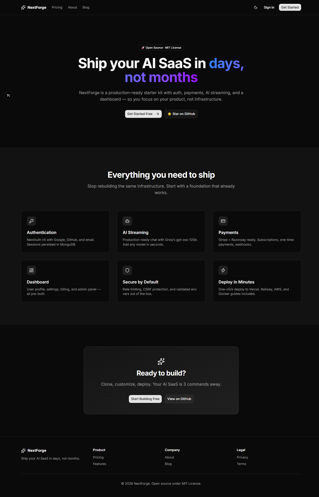
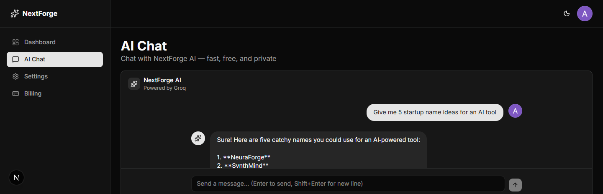
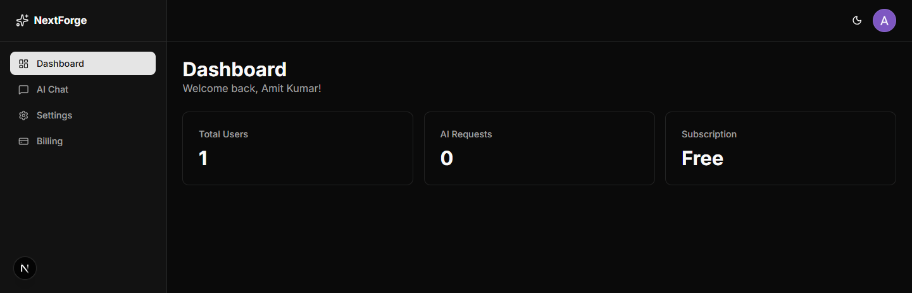

# 🚀 NextForge

**Production-ready AI SaaS Starter Kit**

Ship your AI product in days, not months.

[🚀 Live Demo](https://nextforge-liard.vercel.app) · [Documentation](https://github.com/iamdeveloper17/nextforge#documentation) · [Report Bug](https://github.com/iamdeveloper17/nextforge/issues) · [Request Feature](https://github.com/iamdeveloper17/nextforge/issues)

---

## ✨ What is NextForge?

NextForge is an open-source, production-ready **AI SaaS starter kit**. It gives you the boring but essential infrastructure — authentication, AI streaming, dashboards, payments — so you can focus on what makes your product unique.

Built with **Next.js 16**, **TypeScript**, **MongoDB**, and **Groq** — the modern stack that scales.

## 🎯 Features

- 🔐 **Authentication** — NextAuth v5 with Google OAuth, sessions persisted in MongoDB
- 🤖 **AI Streaming** — Real-time chat with Groq's `gpt-oss-120b`, powered by Vercel AI SDK
- 📊 **Dashboard** — User stats, activity, and a clean sidebar-based layout
- 🎨 **Modern UI** — shadcn/ui (Nova preset) + Tailwind CSS v4 + dark mode
- ⚙️ **Settings Page** — Profile management ready to extend
- 🔒 **Protected Routes** — Server-side auth checks, secure by default
- 📱 **Fully Responsive** — Mobile-first, looks great on any screen
- 🚀 **Deploy-Ready** — One-click deploy to Vercel

## 🛠️ Tech Stack

| Category | Technology |
|----------|-----------|
| Framework | Next.js 16 (App Router, Turbopack) |
| Language | TypeScript |
| Database | MongoDB Atlas + Prisma |
| Authentication | NextAuth v5 + Prisma Adapter |
| AI | Vercel AI SDK + Groq (`gpt-oss-120b`) |
| UI | shadcn/ui (Nova) + Tailwind CSS v4 |
| Icons | Lucide React |
| Theming | next-themes |

## 🚀 Quick Start

### Prerequisites

- Node.js 20+ and npm
- A MongoDB Atlas account ([free tier](https://www.mongodb.com/cloud/atlas/register))
- A Google Cloud project with OAuth credentials ([guide](https://console.cloud.google.com))
- A Groq API key ([free](https://console.groq.com/keys))

### 1. Clone & Install

\`\`\`bash
git clone https://github.com/iamdeveloper17/nextforge.git
cd nextforge
npm install
\`\`\`

### 2. Environment Variables

Copy `.env.example` to `.env.local` and fill in:

\`\`\`bash
cp .env.example .env.local
\`\`\`

Required variables:

\`\`\`bash
# Database
DATABASE_URL="mongodb+srv://..."

# NextAuth
NEXTAUTH_SECRET="run: openssl rand -base64 32"
NEXTAUTH_URL="http://localhost:3000"

# Google OAuth
GOOGLE_CLIENT_ID=""
GOOGLE_CLIENT_SECRET=""

# AI (Groq)
GROQ_API_KEY="gsk_..."
\`\`\`

**Google OAuth setup:**
- Go to [Google Cloud Console](https://console.cloud.google.com)
- Create OAuth 2.0 credentials (Web application)
- Add authorized redirect URI: `http://localhost:3000/api/auth/callback/google`

### 3. Setup Database

\`\`\`bash
npx prisma generate
npx prisma db push
\`\`\`

### 4. Run

\`\`\`bash
npm run dev
\`\`\`

Open [http://localhost:3000](http://localhost:3000) 🎉

## 📸 Screenshots

### 🏠 Landing Page

*Modern hero, features grid, and CTA — all responsive and dark-mode ready.*

### 🤖 AI Chat

*Real-time streaming chat powered by Groq's gpt-oss-120b model.*

### 📊 Dashboard

*Clean sidebar layout with user stats, settings, and billing placeholder.*

## 📁 Project Structure

\`\`\`
nextforge/
├── prisma/
│   └── schema.prisma          # Database schema
├── src/
│   ├── app/
│   │   ├── (auth)/            # Login, Register
│   │   ├── (dashboard)/       # Dashboard, Chat, Settings
│   │   ├── (marketing)/       # Landing, Pricing, About
│   │   └── api/
│   │       ├── auth/          # NextAuth handlers
│   │       └── ai/chat/       # AI streaming endpoint
│   ├── components/
│   │   ├── ai/                # Chat UI
│   │   ├── dashboard/         # Sidebar
│   │   ├── shared/            # Navbar, Footer, Theme toggle
│   │   └── ui/                # shadcn components
│   └── lib/
│       ├── ai.ts              # Groq client
│       ├── auth.ts            # NextAuth config
│       └── db.ts              # Prisma client
\`\`\`

## 🎨 Customization

**Change AI model:**

Edit `src/lib/ai.ts`:

\`\`\`ts
import { groq } from "@ai-sdk/groq";
export const groqModel = groq("openai/gpt-oss-120b");
\`\`\`

Any model on [Groq](https://console.groq.com/docs/models) or [Vercel AI SDK](https://sdk.vercel.ai/providers) works.

**Change branding:**

- Logo: `src/components/shared/navbar.tsx` and `sidebar.tsx`
- Colors: `src/app/globals.css` (CSS variables)
- Metadata: `src/app/layout.tsx`

## 🚀 Deploy

### Vercel (Recommended)

1. Click the button above
2. Add environment variables
3. Deploy

**Important:** Add production redirect URI in Google Cloud Console:
\`\`\`
https://your-domain.vercel.app/api/auth/callback/google
\`\`\`

## 🤝 Contributing

Contributions are welcome! Please read [CONTRIBUTING.md](./CONTRIBUTING.md).

## 📄 License

MIT License — free for personal and commercial use. See [LICENSE](./LICENSE).

## 🙏 Acknowledgments

- [Next.js](https://nextjs.org)
- [shadcn/ui](https://ui.shadcn.com)
- [Vercel AI SDK](https://sdk.vercel.ai)
- [Groq](https://groq.com)
- [Prisma](https://prisma.io)

## ⭐ Support

If this project helps you, please give it a star! It motivates me to keep improving.

---

Built with ❤️ by [Amit Kumar](https://github.com/iamdeveloper17)

